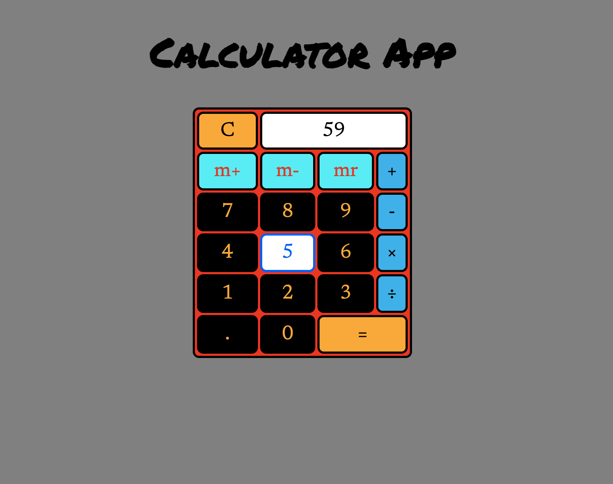

# A Simple Calculator

*A simple and friendly calculator app written in pure HTML, CSS, and vanilla JavaScript*

Check it out <a href="https://andrew-k191.github.io/calculator-app/">here!!!</a>

## Summary

Wow!! I must say I never grasped how intricate and complex a calculator (albeit simple) could really be! This project really changed my perspective. There were so many things that needed to be considered that are taken for granted when using any calculator. Collecting user input, performing arithmetic operations, displaying the result, and saving the result for future use were examples. In many instances my confidence wavered as I was unsure if I could complete this application. I wanted to quit. Things became so challenging that I could not formulate succinct questions to ask that could alleviate my problems. In these moments I could only think to myself: "It's only a simple calculator, surely you can do it!". It was NOT SIMPLE! However, once I took a step back, calmed my emotions, reflected on the progress I made up to this point, and really focused on exactly what I wanted to do each step, I began to make progress. Then a series of breakthroughs. By completion, I was really proud of how well I had performed and persisted. 

I learned so much and also realized where I could do better. On to the next project!!

## Author

* **Andrew Knight** - *Aspiring Software Developer* - (Website)|(LinkeIn)
